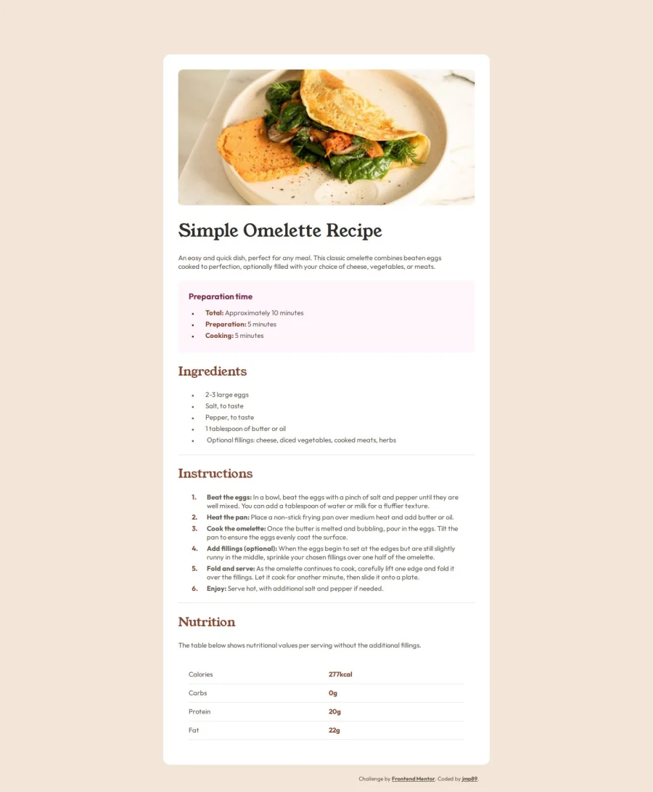

# Frontend Mentor - Recipe page solution

This is a solution to the [Recipe page challenge on Frontend Mentor](https://www.frontendmentor.io/challenges/recipe-page-KiTsR8QQKm). Frontend Mentor challenges help you improve your coding skills by building realistic projects.

## Table of contents

- [Overview](#overview)
  - [The challenge](#the-challenge)
  - [My screenshot](#my-screenshot)
  - [Links](#links)
  - [My process](#my-process)
  - [Built with](#built-with)
  - [What I learned](#what-i-learned)
  - [Continued development](#continued-development)
  - [Author](#author)
  - [Acknowledgments](#acknowledgments)

## Overview

### The challenge

This challenge is an exercise where they expects to get this design starting with the following images as reference, only using HTML and CSS.

### My screenshot

### Desktop version

### Mobile version

g

### Links

- Solution URL: [gitHub repository](https://github.com/jmp89/FM-Recipe)
- Live Site URL: [gitHub deploy](https://jmp89.github.io/FM-Recipe/)

## My process

### Built with

- Semantic HTML5 markup
- CSS custom properties
- Flexbox
- CSS Grid
- Mobile-first workflow

### What I learned

Actually i am student from an academy called HACK A BOSS, where i learned from their bootcamp at the moment HTML, CSS, Vanilla JavaScript + DOM.

I'll gonna try fill my gitHub repositories with much challenges as possible so i can build a better portfolio.

In this challenge (easy level) i've learned how to apply attributes and create styles on the way, just having an image as reference and that's all in my opinion.

I'm sure that my coding is not clean or light as it can be, but with my experience i think i did a good job.

It took me around 4h30min to finish this challenge!

### Continued development

I'm practicing every day to improve my skills as developer, and the next step in the academy's bootcamp is about backend, so i hope that makes me grow nicely.

I worked in a little project for our academy, practicing everything we already learned.

- Hack a Boss Quiz Project - [Check it out](https://github.com/3dmnt/HAB-36-GrupoE)

## Author

- Website - [jmp89](https://github.com/jmp89)
- Frontend Mentor - [@jmp89](https://www.frontendmentor.io/profile/jmp89)

## Acknowledgments

To finish this project, i just followed the instructions that the challenge offers (colors for styles, sizes for screens)
